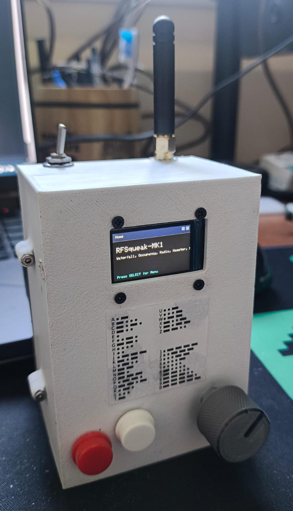
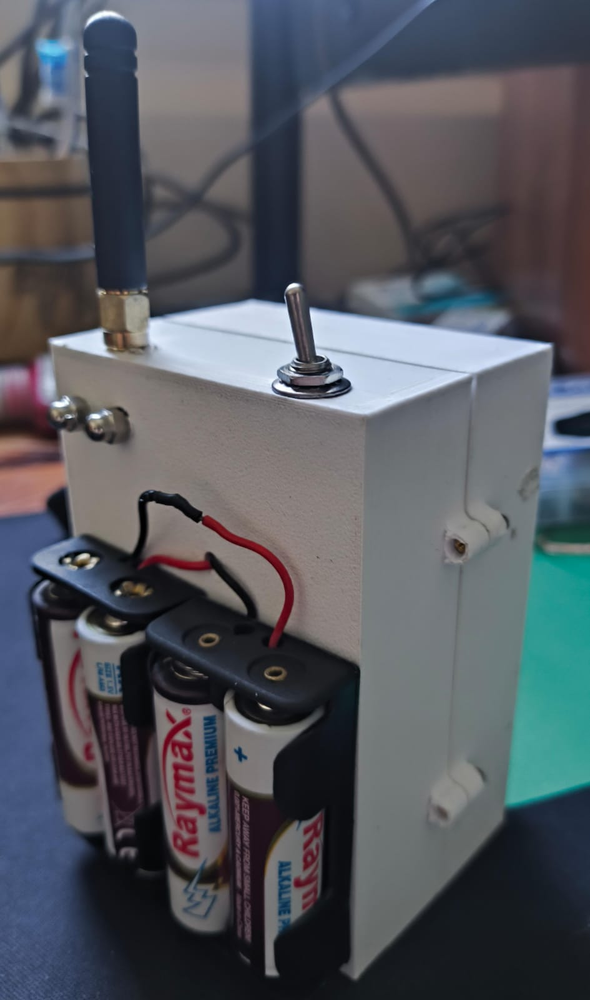

# RFSqueak-MK1: ESP32 + CC1101 RF Spectrum Scanner & Morse Communicator 
## By Roman Kalyna 

Welcome to **RFSqueak-MK1** – an open-source project for RF spectrum analysis and Morse code communication using ESP32 and CC1101 radio modules!

This portable device combines real-time RF spectrum scanning with Morse code communication capabilities, featuring an intuitive interface with OLED display, buttons, and potentiometer control.

---

## 🚀 Features

- **RF spectrum scanning**: Real-time waterfall and occupancy visualization across frequency ranges
- **Morse code communication**: Transmit & receive Morse between nodes with live decoding
- **Button interface**: Intuitive navigation with SELECT and BACK buttons for Morse keying and controls
- **ST7789 color display**: High-resolution OLED for spectrum visualization and Morse text display
- **Potentiometer control**: Smooth frequency tuning, threshold adjustment, and menu navigation
- **Low power operation**: Efficient battery design for portable field use
- **Multiple modes**: Waterfall view, occupancy monitoring, Morse TX/RX, settings, and diagnostic pages

---

## 🔧 Hardware

### Core Components
- **MCU:** ESP32 Dev Board (240MHz dual-core, Wi-Fi/Bluetooth)
- **RF Module:** CC1101 Sub-1GHz transceiver (SPI interface)
- **Display:** ST7789 240×240 color TFT LCD
- **Power:** HW-441 3.3V regulator with 4×AA battery pack (6V input)

### User Interface
- **Buttons:** Two tactile switches (SELECT/BACK) with INPUT_PULLUP configuration
- **Potentiometer:** Analog control for frequency tuning and menu navigation
- **Antenna:** SMA connector for external antenna (433MHz optimized)

### Pin Configuration
- **Display SPI:** CS=5, DC=16, RST=17
- **CC1101 SPI:** CS=27, GDO0=26, GDO2=25
- **Controls:** BTN_SELECT=32, BTN_BACK=33, POT=34 (ADC1)

### Power Requirements
- **Operating voltage:** 3.3V regulated
- **Current consumption:** ~80-150mA (depending on display brightness and RF activity)
- **Battery life:** 8-12 hours typical use with 4×AA alkaline batteries
---

## 🛠️ Wiring Diagram


### Connection Notes
- **Power distribution**: Use common 3.3V rail from HW-441 regulator
- **SPI connections**: Shared MOSI/MISO/SCK between CC1101 and display
- **Button wiring**: Connect to GPIO pins with pull-up resistors (INPUT_PULLUP mode)
- **Critical**: Install 0.1μF (100nF) ceramic bypass capacitors:
  - Between potentiometer GPIO and GND for noise filtering
  - Between CC1101 VCC and GND for power supply decoupling
- **Antenna**: Connect appropriate 433MHz antenna to CC1101 ANT pin
---

## 💻 Software

### Development Environment
- **Platform**: Arduino IDE/PlatformIO with ESP32 core
- **Language**: C++ with Arduino framework
- **Compiler**: ESP32 toolchain (Xtensa LX6)

### Core Libraries
- **RadioLib**: Advanced CC1101 control and modulation
- **Adafruit GFX**: Graphics primitives and text rendering
- **Adafruit ST7789**: Display driver for TFT LCD

### Application Features
- **RF Spectrum Engine**: Real-time frequency scanning with adjustable parameters
  - Configurable frequency range and step size
  - RSSI measurement and threshold detection
  - Waterfall visualization with color-coded signal strength
- **Morse Code System**: Complete encoder/decoder implementation
  - Real-time keying with button interface
  - Automatic timing detection and symbol recognition
  - Configurable dit/dah ratios and gap thresholds
- **User Interface**: Multi-page navigation system
  - Menu-driven interface with potentiometer control
  - Real-time display updates and smooth transitions
  - Settings persistence and configuration management
- **Hardware Abstraction**: Clean driver layer for all peripherals
  - Debounced button handling with edge detection
  - Smooth ADC filtering for potentiometer input
  - Display management with efficient update patterns

---

## 📦 Repository

Find all code and hardware files in this repo:  
[GitHub Repository](https://github.com/romankalyna/RFsquek)

---

## 📚 Getting Started

### Prerequisites
- Arduino IDE with ESP32 board package installed
- Required libraries: RadioLib, Adafruit GFX, Adafruit ST7789
- Basic soldering skills for hardware assembly

### Build Instructions
1. **Clone the repository:**
   ```bash
   git clone https://github.com/romankalyna/RFsquek
   cd RFsquek
   ```

2. **Install dependencies:**
   - Open Arduino IDE
   - Install ESP32 board package via Board Manager
   - Install required libraries via Library Manager:
     - RadioLib by Jan Gromeš
     - Adafruit GFX Library
     - Adafruit ST7735 and ST7789 Library

3. **Hardware assembly:**
   - Follow the wiring diagram for connections
   - Install bypass capacitors as specified
   - Connect appropriate 433MHz antenna

4. **Software configuration:**
   - Open `RFsquek.ino` in Arduino IDE
   - Select ESP32 board and appropriate port
   - Compile and upload to ESP32

5. **First run:**
   - Power up with 4×AA batteries
   - Use SELECT button to navigate menu
   - Start with "Radio" for basic RF scanning
   - Try "Morse TX/RX" for communication testing

### Operation
- **Navigation**: Use potentiometer to scroll, SELECT to choose, BACK to return
- **RF scanning**: Select "Waterfall" or "Occupancy" modes for spectrum analysis
- **Morse operation**: Use "Morse TX" for transmission, "Morse RX" for reception
- **Settings**: Adjust frequency range, thresholds, and timing parameters

---

## ⚙️ Technical Specifications

### RF Performance
- **Frequency range**: 300-928 MHz (CC1101 dependent)
- **Default frequency**: 433.92 MHz (ISM band)
- **Modulation**: OOK, ASK, FSK, MSK (software configurable)
- **Sensitivity**: -110 dBm typical
- **Output power**: +10 dBm max (configurable)
- **Bandwidth**: 58-812 kHz selectable

### Display & Interface
- **Display**: 240×240 ST7789 TFT, 16-bit color
- **Refresh rate**: ~10-50 Hz (mode dependent)
- **Input**: 2 tactile buttons + analog potentiometer
- **Menu system**: Multi-level navigation with visual feedback

### Performance Metrics
- **Scan rate**: 100-1000 channels/second (configurable)
- **Morse timing**: Auto-detect or manual (5-50 WPM)
- **Memory usage**: ~200KB Flash, ~20KB RAM
- **Boot time**: <2 seconds to operational

### Physical
- **Dimensions**: Custom enclosure (see photos)
- **Weight**: ~300g with batteries
- **Battery**: 4×AA (6V nominal, 3.3V regulated)
- **Connectors**: SMA antenna, USB-C programming

---

## 🖼️ Gallery




---

## ✨ Credits

- Project by [romankalyna](https://github.com/romankalyna)
- Thanks to the RF and open-source communities!

---

## 📞 Contact

Questions or feedback?  
Open an issue or contact me via GitHub.

## 📚 Libraries Used

This project uses the following libraries:

- [Adafruit GFX](https://github.com/adafruit/Adafruit-GFX-Library)
- [Adafruit ST7789](https://github.com/adafruit/Adafruit-ST7735-Library) 
- [RadioLib](https://github.com/jgromes/RadioLib)

These libraries are used as dependencies via their public APIs. No code was copied directly from them.
