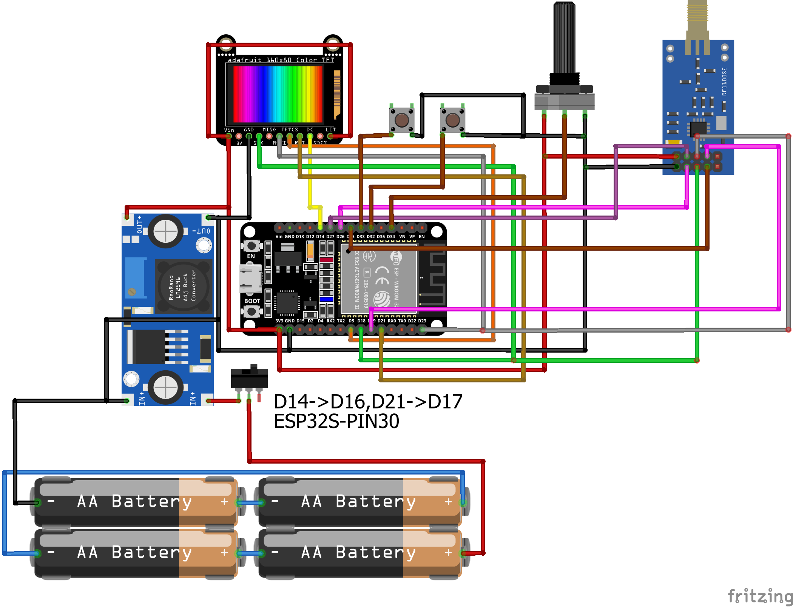

# RFsquek: ESP32 + CC1101 RF Spectrum Scanner & Morse Communicator

Welcome to **RFsquek** – an open-source project for RF spectrum analysis and Morse code communication using ESP32 and CC1101 radio modules!

---

## 🚀 Features

- **RF spectrum scanning**: Visualize channel activity and occupancy (“waterfall” view)
- **Morse code communication**: Transmit & receive Morse between nodes
- **Button interface**: For Morse keying and controls
- **OLED/Display support**: (optional) Real-time spectrum or Morse display
- **Sensor integration**: Add analog/digital sensors for telemetry
- **Low power operation**: Efficient design for portable use

---

## 🔧 Hardware

- **MCU:** ESP32 Dev Board
- **RF Module:** CC1101 (SPI)
- **Power:** HW-441 3.3V regulator (4AA batteries)
- **Buttons:** For Morse key, scan, menu
- **OLED Display:** For spectrum & Morse visualization 
- **potentiometer** For changes in waves,treshholds and scrolling

---

## 🛠️ Wiring Diagram



- **CC1101 SPI pins**: Connect as written
- **Buttons**: GPIO to GND (INPUT_PULLUP)
- **OLED Pins** Connect as written 
- **Power**: Common VCC (3.3V) and GND via HW-441

---

## 💻 Software

- **Arduino/C++**
- **CC1101 library** for RF control
- **Spectrum scan logic**: Waterfall/frequency occupancy detection
- **Morse code encoder/decoder**
- **Button handler** (debouncing, events)
- **Display driver** 
- **Serial output** for debugging/logging

---

## 📦 Repository

Find all code and hardware files in this repo:  
[GitHub Repository](https://github.com/romankalyna/RFsquek)

---

## 📚 Getting Started

1. Clone the repository:
   ```
   git clone https://github.com/romankalyna/RFsquek
   ```
2. Flash the code to your ESP32.
3. Connect hardware as shown in the wiring diagram.
4. Power up and start scanning or communicating in Morse!

---

## 🖼️ Gallery


---

## ✨ Credits

- Project by [romankalyna](https://github.com/romankalyna)
- Thanks to the RF and open-source communities!

---

## 📞 Contact

Questions or feedback?  
Open an issue or contact me via GitHub.
